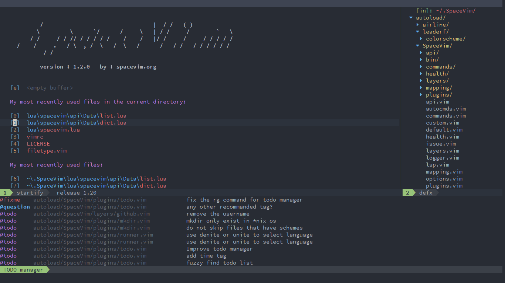
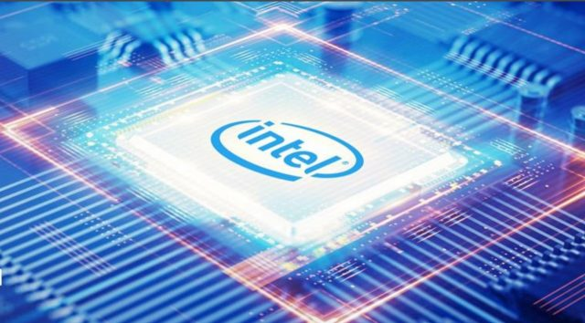

# Welcome to My Webpage!!!

A little about me! I am a **third year** undergraduate as a **Computer Engineering** major studying at **Georgia Institute of Technology**.
Full time student looking for a summer internship in 2020. I finish undergraduate studies in Spring 2021, and I plan to pursue a higher degree.  
Here is a [link](https://www.linkedin.com/in/matthew-liu-315aa014b/) to my LinkedIn page.


# What to Find Here! <a name ="top"></a>
- [How to Create this Webpage](#webpage)  
- [My Hobbies and Interests](#interests)  
- [Courses Completed by Spring 2020 (_w/ descriptions_)](#courses)  
- [Work Experience](#work)  
- [Projects](#projects)  
- [Documents](#documents)  
- [Other Activities](#activities)  
----

## Website Information! <a name = "webpage"></a>
This webpage is a fun independent project created for Technical Communications Class (ECE3005).  
It is hosted and powered by Github Pages/Jekyll and the theme is by Matt Graham [github](https://github.com/mattgraham)  
I used Markdown which is a simple, light-weight syntax for styling writing   
You can fork/clone this project at my github repo [page](https://github.com/matthewliu2000/page)  


----

## Hobbies and Interests! <a name = "interests"></a>
**Hobbies!! :** piano, chess, basketball, anime, film, TV series, hiking, snowboarding, skiing, gaming, linux, vim editor  
**Interests!! :** traveling, video editing, music production, food, science fiction, hardware development, validation, automation, machine learning, web design, consumer technologies 




----

## ECE Courses <a name = "courses"></a>
[Hardware and Software Programming:](ece2035.ece.gatech.edu) Instruction set architecture datapath and controller, memory (stack, heap, static), data abstractions (structs, arrays, linked lists, hash tables), File I/O, Embedded software, basic concurrency in multicore systems, assembly level programming, procedural abstraction (function calls, activation frames, etc.)  

[Digital Design Laboratory:](https://www.ece.gatech.edu/courses/course_outline/ECE2031) implement simple computer within a PLD, VHDL (design, implement, simulate circuits), design with graphical CAD tools, machine language and assembly language programs for simple computer, FPGAs, HDL based simulation and synthesis with FPGAs, oscilloscope, logic analyzer, timing simulation, state machine implementation, design verification with logic analyzer, combinational design using primitive gates, schematic capture, and VHDL  

[Circuit Analysis:](https://www.ece.gatech.edu/courses/course_outline/ECE2040) Voltage, Current, Power, Energy, Kirchoff, linearity, superposition, Thevenin, Norton, Op Amps, first and second order circuits, RLC circuits, forcing functions, sinusoidal steady-state analysis, resonance, phasors, impedance, power analysis (instantaneous and average power, complex power, max power transfer)  

[Signal Processing:](https://www.ece.gatech.edu/courses/course_outline/ECE2026) Phasors, sinusoids, harmonics, spectrogram analysis, Fourier series synthesis and analysis, aliasing, folding, continuous vs discrete time domains, convolution, filters (low, high, bandpass), DFT, Z-transform for FIR, MATLAB, Image enhancement, Time frequency analysis, sound and music synthesis, sample reconstruction  

[Math Foundations for Computer Engineering:](http://blough.ece.gatech.edu/3020/outline.pdf) discrete math, proofs, computational complexity, Fast Fourier transform, error detection and correction codes (parity coding), data abstractions, graph theory (trees, lists, Prim’s, Dykstra’s algorithms, etc.), regular expressions, state minimization, algorithms (searching, sorting, closest path, recursion etc.)  

[Physical Foundations for Computer Engineering:](https://www.ece.gatech.edu/courses/course_outline/ECE3030) Physical Implementation of a bit (barrier model), physics of CMOS based computation (semiconductor physics, MOSFET and device physics, switches as computing devices), physics of data communication via propagation through wire, alternative computing models (quantum computing)  

[Computer Architecture, Systems, Concurrency and Energy in Computation:](https://www.ece.gatech.edu/courses/course_outline/ECE3057) instruction set architecture (mutli-cycle data path and control, controller implementation), CPU pipeline (hazards and solutions, branch prediction), Memory Systems (caches, main memory, virtual memory basics, OS level algorithms), Concurrency (threads, ILP, DLP, TLP), Energy and Power dissipation (microarchitecture-level, power virus, kernel benchmarks), I/O architecture and operating system support, CPU scheduling  

Also Completed All Core Courses (i.e. Physics, Calculus, Discrete Math, English, etc.)  

See embedded links for more details

----

## Work Experience <a name = "work"></a> 

Intel Corporation - RTL Validation Engineering Intern  



JDL International - IT & Marketing Intern  
 

CIRA - NOAA Research Lab - Research Assistant and Clmate Researcher  


----

## Projects <a name = "projects"></a>
FPGA Controlled Autonomous "Wall Following Bot"


----

## Documents <a name = "documents"></a>
DE2Bot Design Summary and Documentation


----

## Activites <a name = "activities"></a>
Phi Sigma Pi - National Honor Fraternity for Scholarship, Leadership, and Fellowship
Concert Pianist - IKOF silver medalist, orchestra, PianoForte Org
Chess Club 
Studnet Alumni Association

----


```

For more details see [GitHub Flavored Markdown](https://guides.github.com/features/mastering-markdown/).

### Jekyll Themes

Your Pages site will use the layout and styles from the Jekyll theme you have selected in your [repository settings](https://github.com/matthewliu2000/htmlwebpage/settings). The name of this theme is saved in the Jekyll `_config.yml` configuration file.

### Support or Contact

Having trouble with Pages? Check out our [documentation](https://help.github.com/categories/github-pages-basics/) or [contact support](https://github.com/contact) and we’ll help you sort it out.
