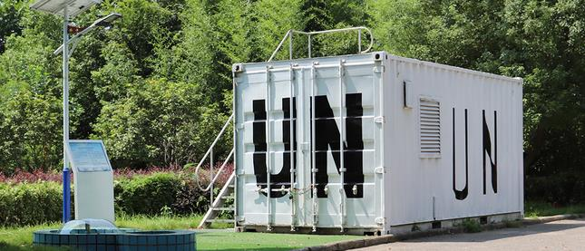
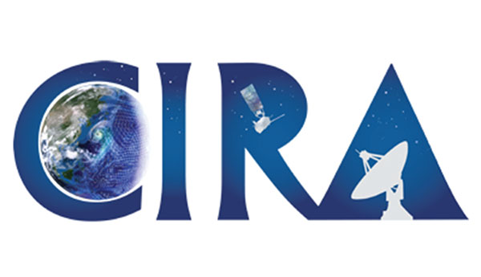
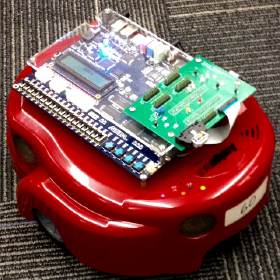
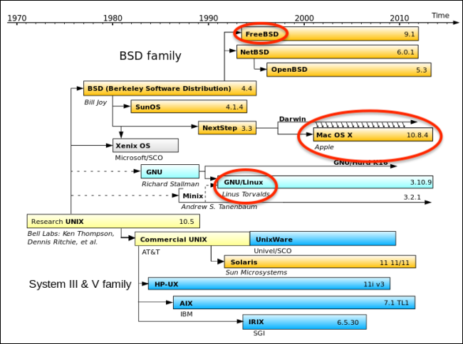
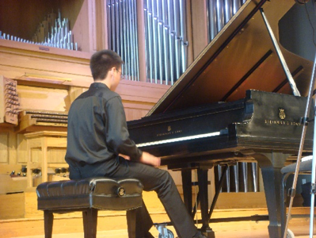

# Welcome to My Webpage!!!

A little about me! I am a **third year** undergraduate as a **Computer Engineering** major studying at **Georgia Institute of Technology**.
Full time student looking for a summer internship in 2020. I finish undergraduate studies in Spring 2021, and I plan to pursue a higher degree.  
Here is a [link](https://www.linkedin.com/in/matthew-liu-315aa014b/) to my LinkedIn page.  
Here is a [link](https://github.com/matthewliu2000/page) to my github page.  


# What to Find Here! <a name ="top"></a>
- [How to Create this Webpage](#webpage)  
- [Courses Completed by Spring 2020 (_w/ descriptions_)](#courses)  
- [Work Experience](#work)  
- [Projects](#projects)  
- [Documents](#documents)  
- [Activites](#activities)  
- [My Hobbies and Interests](#interests)  
- [Contact and Support](#contact)  

----
## Website Information! <a name = "webpage"></a>
This webpage is a fun independent project created for Technical Communications Class (ECE3005).  
It is hosted and powered by Github Pages/Jekyll and the original theme is by [Matt Graham](https://github.com/mattgraham)  
I used Markdown which is a simple, light-weight syntax for styling writing   
You can fork/clone this project at my github [repository page](https://github.com/matthewliu2000/page)  


Back to [Top](#top)!

----
## ECE Courses <a name = "courses"></a>
[Hardware and Software Programming:](https://ece2035.ece.gatech.edu) Instruction set architecture datapath and controller, memory (stack, heap, static), data abstractions (structs, arrays, linked lists, hash tables), File I/O, Embedded software, basic concurrency in multicore systems, assembly level programming, procedural abstraction (function calls, activation frames, etc.)  

[Digital Design Laboratory:](https://www.ece.gatech.edu/courses/course_outline/ECE2031) implement simple computer within a PLD, VHDL (design, implement, simulate circuits), design with graphical CAD tools, machine language and assembly language programs for simple computer, FPGAs, HDL based simulation and synthesis with FPGAs, oscilloscope, logic analyzer, timing simulation, state machine implementation, design verification with logic analyzer, combinational design using primitive gates, schematic capture, and VHDL  

[Circuit Analysis:](https://www.ece.gatech.edu/courses/course_outline/ECE2040) Voltage, Current, Power, Energy, Kirchoff, linearity, superposition, Thevenin, Norton, Op Amps, first and second order circuits, RLC circuits, forcing functions, sinusoidal steady-state analysis, resonance, phasors, impedance, power analysis (instantaneous and average power, complex power, max power transfer)  

[Signal Processing:](https://www.ece.gatech.edu/courses/course_outline/ECE2026) Phasors, sinusoids, harmonics, spectrogram analysis, Fourier series synthesis and analysis, aliasing, folding, continuous vs discrete time domains, convolution, filters (low, high, bandpass), DFT, Z-transform for FIR, MATLAB, Image enhancement, Time frequency analysis, sound and music synthesis, sample reconstruction  

[Math Foundations for Computer Engineering:](http://blough.ece.gatech.edu/3020/outline.pdf) discrete math, proofs, computational complexity, Fast Fourier transform, error detection and correction codes (parity coding), data abstractions, graph theory (trees, lists, Prim’s, Dykstra’s algorithms, etc.), regular expressions, state minimization, algorithms (searching, sorting, closest path, recursion etc.)  

[Physical Foundations for Computer Engineering:](https://www.ece.gatech.edu/courses/course_outline/ECE3030) Physical Implementation of a bit (barrier model), physics of CMOS based computation (semiconductor physics, MOSFET and device physics, switches as computing devices), physics of data communication via propagation through wire, alternative computing models (quantum computing)  

[Computer Architecture, Systems, Concurrency and Energy in Computation:](https://www.ece.gatech.edu/courses/course_outline/ECE3057) instruction set architecture (mutli-cycle data path and control, controller implementation), CPU pipeline (hazards and solutions, branch prediction), Memory Systems (caches, main memory, virtual memory basics, OS level algorithms), Concurrency (threads, ILP, DLP, TLP), Energy and Power dissipation (microarchitecture-level, power virus, kernel benchmarks), I/O architecture and operating system support, CPU scheduling  

Also Completed All Core Courses (i.e. Physics, Calculus, Discrete Math, English, etc.)  

See embedded [links](https://matthewliu2000.github.io/page/) for more details

Back to [Top](#top)!

----
## Work Experience <a name = "work"></a> 

[Intel Corporation](https://www.intel.com/content/www/us/en/homepage.html) - RTL Validation Engineering Intern  
  

[JDL International - IT & Marketing Intern](https://jdlinternationalinc.com/)  
   

[CIRA](https://www.cira.colostate.edu/) - NOAA Research Lab - Research Assistant and Climate Researcher  


----
## School Projects <a name = "projects"></a>
FPGA Controlled Autonomous "Wall Following Bot"  
  
github repo:   

RPG Game made with MBED Hardware and Programmed in C
[Video Recording of Game + Playthrough](https://www.youtube.com/watch?v=Wtsbtr2bRxA&t=252s)  
  
github repo:   

Pacman Game with MBED Hardware and Programmed in C++  
github repo:   


Heap Data Structure developed w/ linked list implemented in C  
github repo:   

Back to [Top](#top)!

----
## Documents <a name = "documents"></a>
DE2Bot Design Summary and Documentation:  
[DE2_Design_Summary.docx](./assets/projectdesignsummWorking.docx)  
Presentation:  
[DE2_Bot_Proposal](./assets/Running_Rock.pptx)  

Short Technical Write-Ups  
1. [Propagation_Delay_and_Oscilloscope_Measurements.pdf](./assets/LabReport3_final_version_3.pdf)  
2. [IOT_RiskBenefitStudy.docx](./assets/IoT_ResearchPaper.docx)  

Back to [Top](#top)!

---
## Hobbies and Interests! <a name = "interests"></a>
- **Hobbies!! :** piano, chess, basketball, anime, film, TV series, hiking, snowboarding, skiing, gaming, linux, vim editor  
- **Interests!! :** traveling, video editing, music production, food, science fiction, hardware development, validation, automation, machine learning, web design, consumer technologies   

Glenwood Springs - August 2019  
  

Steamboat Springs - December 2018  
  

Unix/Linux Distributions  
  

Pieces being worked on currently:  
- Glinka-Balakirev: The Lark  
- Rachminoff Prelude op23 no5   

Organ Hall Recorded Performance 2013  
[Chopin - Fantaisie Impromptu](https://www.youtube.com/watch?v=hCwSzsDiuXU)  
[Debussy - Children's Corner](https://www.youtube.com/watch?v=o_pqU2owgCs)  
  
[Bach - French Suite no.6 in E major, Finalist Recital](https://www.youtube.com/watch?v=o_pqU2owgCs)  

Back to [Top](#top)!

----
## Activities <a name = "activities"></a>
Phi Sigma Pi - National Honor Fraternity for Scholarship, Leadership, and Fellowship  
Concert Pianist - IKOF silver medalist, Orchestra, PianoForte Org  
Chess Club   
Student Alumni Association  

Back to [Top](#top)!

----
### Contact and Support <a name ="contact"></a>
Website Issues: 1matthewliu2000@gmail.com  
Professional Contact: matthew.liu@gatech.edu  

```markdown
For more details see [GitHub Flavored Markdown](https://guides.github.com/features/mastering-markdown/).

### Jekyll Themes

[repository settings](https://github.com/matthewliu2000/htmlwebpage/settings). Theme saved in the Jekyll `_config.yml` configuration file.


Starting your own Page? Check out [documentation](https://help.github.com/categories/github-pages-basics/) or [contact support](https://github.com/contact).
```
Back to [Top](#top)!
