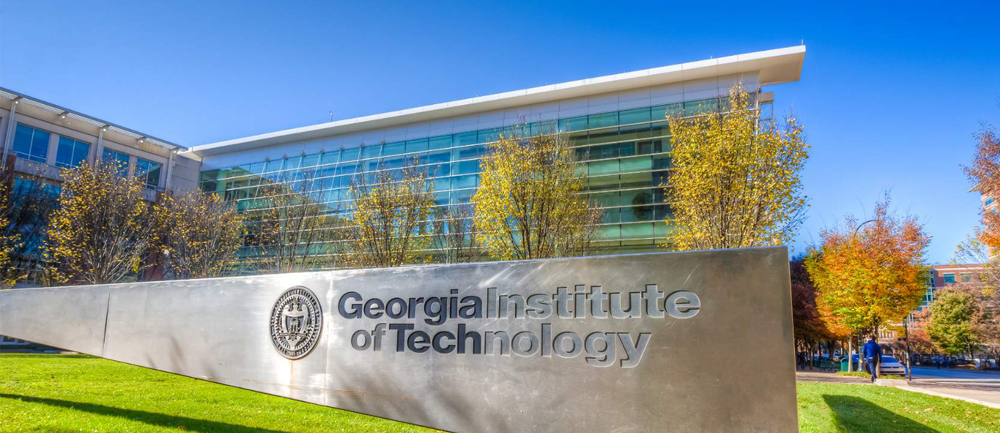
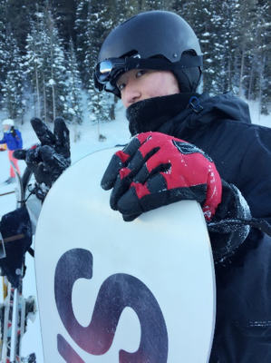

# Welcome to My Webpage!!!

A little about me! I am from Fort Collins, Colorado, and I am a **third year** undergraduate studying **Computer Engineering** at **Georgia Institute of Technology**.
Full time student looking for a summer internship in 2020, complete undergraduate studies in Spring 2021, and planning to pursue a graduate degree and seek future employment.   
  
Here is a [link](https://www.linkedin.com/in/matthew-liu-315aa014b/) to my LinkedIn page.  
Here is a [link](https://github.com/matthewliu2000/page) to my github page.  
Here is a download [link](./assets/Matthew_Liu_CV_Oct25_2019.docx) for my resume.  


# What to Find Here! <a name ="top"></a>
- [How to Create this Webpage](#webpage)  
- [Objective Statement](#aboutme)  
- [Courses Completed by Spring 2020 (_w/ descriptions_)](#courses)  
- [Work Experience](#work)  
- [Projects](#projects)  
- [Documents](#documents)  
- [Activities](#activities)  
- [My Hobbies and Interests](#interests)  
- [Contact and Support](#contact)  

----
## Website Information! <a name = "webpage"></a>
This webpage is a fun independent project created for Technical Communications Class (ECE3005).  
It is hosted and powered by Github Pages/Jekyll and the original theme is by [Matt Graham](https://github.com/mattgraham)  
I used Markdown which is a simple, light-weight syntax for styling writing   
You can fork/clone this project at my github [repository page](https://github.com/matthewliu2000/page)  


Back to [Top](#top)!

---
## Quick Bio <a name = "aboutme"></a>
Third year Computer Engineer Student at Georgia Tech with industry experience in hardware engineering specializing in pre-silicon validation within an microcontroller of an SoC. Adaptable, resourceful, and adept at working in focused and collaborative environments, debugging problems during testing, and creating or finding solutions. Successful in climate research and other multi-disciplinary internships. Actively looking for hardware design engineering internships and co-ops Spring and Summer 2020.  

My career goal is to immerse myself with comprehensive, interdisciplinary knowledge in computer engineering and computer science, and become well trained in integrating hardware and software, as well as application of engineering concepts and methods to computer systems engineering and design. Academically, I may aim for a masters or doctorate degree in ECE from which, or concurrently, pursue work in research or industry.  

----
## ECE Courses <a name = "courses"></a>
[Hardware and Software Programming:](https://ece2035.ece.gatech.edu) Instruction set architecture datapath and controller, memory (stack, heap, static), data abstractions (structs, arrays, linked lists, hash tables), File I/O, Embedded software, basic concurrency in multicore systems, assembly level programming, procedural abstraction (function calls, activation frames, etc.)  

[Digital Design Laboratory:](https://www.ece.gatech.edu/courses/course_outline/ECE2031) implement simple computer within a PLD, VHDL (design, implement, simulate circuits), design with graphical CAD tools, machine language and assembly language programs for simple computer, FPGAs, HDL based simulation and synthesis with FPGAs, oscilloscope, logic analyzer, timing simulation, state machine implementation, design verification with logic analyzer, combinational design using primitive gates, schematic capture, and VHDL  

[Circuit Analysis:](https://www.ece.gatech.edu/courses/course_outline/ECE2040) Voltage, Current, Power, Energy, Kirchoff, linearity, superposition, Thevenin, Norton, Op Amps, first and second order circuits, RLC circuits, forcing functions, sinusoidal steady-state analysis, resonance, phasors, impedance, power analysis (instantaneous and average power, complex power, max power transfer)  

[Signal Processing:](https://www.ece.gatech.edu/courses/course_outline/ECE2026) Phasors, sinusoids, harmonics, spectrogram analysis, Fourier series synthesis and analysis, aliasing, folding, continuous vs discrete time domains, convolution, filters (low, high, bandpass), DFT, Z-transform for FIR, MATLAB, Image enhancement, Time frequency analysis, sound and music synthesis, sample reconstruction  

[Math Foundations for Computer Engineering:](http://blough.ece.gatech.edu/3020/outline.pdf) discrete math, proofs, computational complexity, Fast Fourier transform, error detection and correction codes (parity coding), data abstractions, graph theory (trees, lists, Prim’s, Dykstra’s algorithms, etc.), regular expressions, state minimization, networks, algorithms (searching, sorting, closest path, recursion etc.)  

[Physical Foundations for Computer Engineering:](https://www.ece.gatech.edu/courses/course_outline/ECE3030) Physical Implementation of a bit (barrier model), physics of CMOS based computation (semiconductor physics, MOSFET and device physics, switches as computing devices), physics of data communication via propagation through wire, alternative computing models (quantum computing)  

[Computer Architecture, Systems, Concurrency and Energy in Computation:](https://www.ece.gatech.edu/courses/course_outline/ECE3057) instruction set architecture (mutli-cycle data path and control, controller implementation), CPU pipeline (hazards and solutions, branch prediction), Memory Systems (caches, main memory, virtual memory basics, OS level algorithms), Concurrency (threads, ILP, DLP, TLP), Energy and Power dissipation (microarchitecture-level, power virus, kernel benchmarks), I/O architecture and operating system support, CPU scheduling  

Also Completed All Core Courses (i.e. Physics, Calculus, Discrete Math, English, etc.)  

See embedded [links](https://matthewliu2000.github.io/page/) for more details

Back to [Top](#top)!

----
## Work Experience <a name = "work"></a> 

[Intel Corporation](https://www.intel.com/content/www/us/en/homepage.html) - RTL Validation Engineering Intern  
- Contributed to development of new BFM within pre-silicon validation environment for modeling power management firmware responses by improving code modularity and resuse and minimized reliance on firmware to validate RTL  
- For supported regression tests, the BFM reduces CPU model time by 27% and total cycles by 75%, enabling more efficient, more reliable, and timelier validation  
  

[JDL International - IT & Marketing Intern](https://jdlinternationalinc.com/)  
Waste water treatment company that develops and designs modular, on-site bioreactor technology to treat contaminated water. The company works with public and private organizations, like the UN, whom are concerned with environmental protection  
- Contributed in a variety of different IT, engineering, and marketing roles  
- Improved, fixed, and identified bugs on company website  
- Procured and conducted data analysis of water quality before and after FMBR treatme  
- Participated and observed an on-site installation of equipmen  
- Attended trade shows, conferences, and onsite trainings on environmental protection  
   

[CIRA](https://www.cira.colostate.edu/) - NOAA Research Lab - Research Assistant and Climate Researcher  
CIRA is a nexus for multi-disciplinary cooperation between atmospheric and NOAA research scientists
- Gathered NOAA weather station data, parsed and analyzed the data (CSV files), with Fortran models, MATLAB, and GrADs (atmospheric science visual data analysis tool) and presented at Third Pole Environmental Conference
- Worked with senior research scientist, Dr. Glen Liston to perform data analysis and modeling on regional conditional variations specifically within the Rocky Mountains, Alaska, and Greenland Ice sheets


----
## Projects <a name = "projects"></a>
**FPGA Controlled Autonomous "Wall Following Bot"**  
(see [below](#documents) for documentation)   
HW and SW Programmer, ECE Department, ECE2031  
Collective effort of four computer engineering and science majors  
- Developed an algorithm for wall following with a team of four computer engineering students by programming a DE2 board modified amigo bot (used Intel Quartus CAD tool for design)  
- Partially programmed the simple programmable computer (used by the amigobot) onto a FPGA with a processor, memory, and IO bus for interfacing with peripheral devices  
  
github repo:   

**RPG Game made with MBED Hardware and Programmed in C**  
HW Design and Programmer, ECE Department, ECE2035  
- Independently developed a RPG, quest-based game using Mbed hardware.  
- Constructed a gaming circuit, coded in C, hash table data structure, OOP, interface between hardware and software  
[Video Recording of Game + Playthrough](https://www.youtube.com/watch?v=Wtsbtr2bRxA&t=252s)  
  
github repo:   

**Minesweeper Computer Generated Solution**  
SW Programmer, ECE Department, ECE2035  
- Developed a computer-generated solution to the Minesweeper game using square inferencing techniques coded in both C and MIPS assembly language. Seeding the program generates different a random map for itself to solve.  
- Optimized memory, and reduced static and dynamic instructions  
  

**Pacman Game with MBED Hardware and Programmed in C++**   
  
github repo:  

**Heap Data Structure developed w/ linked list implemented in C**  
github repo:   

**VPython Physics Simulations**  
- Modeled electro-magnetic fields, charged objects (rods,disks,etc.), electrons, particle trajectories in gravitational field, 2D/3D motion, springs, etc. 

  
github repo:  

**Twitter API - Tweet Sentiment Analysis**  
- Utilized programming skills in Python to conduct sentiment analysis on Tweets  
- Accessed real-time twitter messages using programs and made inferences from diction and semantics  

**Third Pole Environmental Conference Poster**  

**Simple Computer (SCOMP) written in VHDL**  
- Programmed a simple programmable computer onto an FPGA w/ a processor, memory, and IO bus for interfacing with peripheral devices.   
- [SCOMP Code, Simulation, and Design](./assets/LabReport8vfinal_withAppendix.pdf)  
- [SCOMP Simulation Waveform and Schematics Oscilloscope Measurements](./assets/LabReport6.pdf)  

**Train State Machine (VHDL)**  
- [Train Code, UML State Chart, and State Design](./assets/TrainLab.pdf)  

**Internet Radio Broadcasting Station**  
- Installed and manipulated Icecast, Iceweasel, and Ezstream into a BeagleBoard with UXTerm  
- Utilized IceCast to start a streaming service, capable of running and broadcasting our own music  
- Implemented basic programming skills in Java and Python during the project  

**Synchronous Clocked Finite State Machine(Physical Design)**  
- Created using NI myDAQ instruments, breadboard, decoders, inverters, flipflops, etc.  

**"Flappy Bird" Game Design in Unity**  

**Signal Processing in MATLAB**  
- Plotting spectrograms, identifying folding, aliasing, filter design, interference removal, etc.   

**MATLAB Website Development Project**  
Access to WebPage [here](http://www.prism.gatech.edu/~mliu362/)  

**Blackjack Simulation Game**  
- Coded in MATLAB  

Back to [Top](#top)!

----
## Documents <a name = "documents"></a>
DE2Bot Design Summary and Documentation:  
[DE2_Design_Summary.docx](./assets/projectdesignsummWorking.docx)  
Presentation:  
[DE2_Bot_Proposal](./assets/Running_Rock.pptx)  

**ECE3005 Technical Communications Website Design Presentation**  

**Third Pole Environmental Conference Poster**  

Short Technical Write-Ups  
1. [Simple Computer Designed in VHDL on FPGA](./assets/LabReport8vfinal_withAppendix.pdf)  
2. [Propagation_Delay_and_Oscilloscope_Measurements.pdf](./assets/LabReport3_final_version_3.pdf)  
3. [IOT_RiskBenefitStudy.docx](./assets/IoT_ResearchPaper.docx)  

Back to [Top](#top)!

---
## Hobbies and Interests! <a name = "interests"></a>
- **Hobbies!! :** piano, chess, basketball, classical films, TV, hiking, snowboarding, skiing, gaming, linux, vim editor  
- **Interests!! :** traveling, video editing, music production, food, science fiction, hardware development, validation, automation, machine learning, web design, consumer technologies   

Glenwood Springs - August 2019  
  

Steamboat Springs - December 2018  
  

Unix/Linux Distributions  
  

Pieces being worked on currently:  
- Glinka-Balakirev: The Lark  
- Rachminoff Prelude op23 no5   

Organ Hall Recorded Performance 2013  
International Keyboard Odyssiad Festival - Silver Medalist  
[Chopin - Fantaisie Impromptu](https://www.youtube.com/watch?v=hCwSzsDiuXU)  
[Debussy - Children's Corner](https://www.youtube.com/watch?v=o_pqU2owgCs)  
[Bach - French Suite no.6 in E major, Finalist Recital](https://www.youtube.com/watch?v=o_pqU2owgCs)  
  

Back to [Top](#top)!

----
## Activities <a name = "activities"></a>
Phi Sigma Pi - National Honor Fraternity for Scholarship, Leadership, and Fellowship  
Chess Club   
Student Alumni Association  
Concert Pianist - IKOF silver medalist[competition information](http://odyssiad.com/), Orchestra, PianoForte Org  
  
   
  

Back to [Top](#top)!

----
### Contact and Support <a name ="contact"></a>
Website Issues: 1matthewliu2000@gmail.com  
Professional Contact: matthew.liu@gatech.edu  

```markdown
For more details see [GitHub Flavored Markdown](https://guides.github.com/features/mastering-markdown/).

### Jekyll Themes

[repository settings](https://github.com/matthewliu2000/htmlwebpage/settings). Theme saved in the Jekyll `_config.yml` configuration file.


Starting your own Page? Check out [documentation](https://help.github.com/categories/github-pages-basics/) or [contact support](https://github.com/contact).
```
Back to [Top](#top)!
